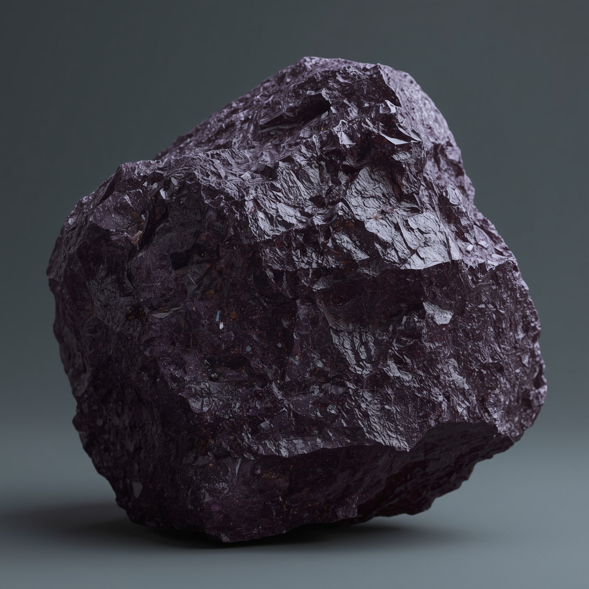

### 🪨 Цестюлит

**Название:** Цестюлит  
**Тип ресурса:** Руда  

**Описание:**  
Плотный минерал глубокого тёмно-фиолетового оттенка с редкими микроблесками в толще. Имеет неровную, многогранную поверхность, словно состоящую из пересекающихся кристаллических пластин. При сильном освещении видны слабые металлические отблески, создающие впечатление «скрытой» внутренней энергии. Отличается высокой плотностью и сопротивлением к механическому разрушению.

**Место обитания:**  
Открытый космос, встречается в астероидах:  
• **M-класса** — крупные металлические астероиды, в которых Цестюлит образует жёсткие вкрапления в рудных жилах.  
• **C-класса** — малые углеродистые астероиды, где он встречается реже, но с более чистой структурой.  

Чаще всего залегает в глубине на 2–5 м под поверхностью, в трещинах и полостях, сформированных ударными процессами.

**Редкость:**  
Редкая порода, встречаемость — около 10–12% даже в подходящих астероидах.

**Применение:**  
• **Вооружение:** бронебойные сердечники, ударные наконечники и сегменты для кинетического оружия.  
• **Экипировка:** элементы тяжёлой брони, защитные пластины для кораблей и станций, каркасы энергетических щитов.  
• **Промышленные сплавы:** основа для сверхплотных сплавов, устойчивых к перегрузкам, а также для деталей, работающих при экстремальных давлениях и температурах.

---

### 🔙 Навигация
[← Вернуться назад](../список.md)  
[🏠 На главную](../../../index.md)
