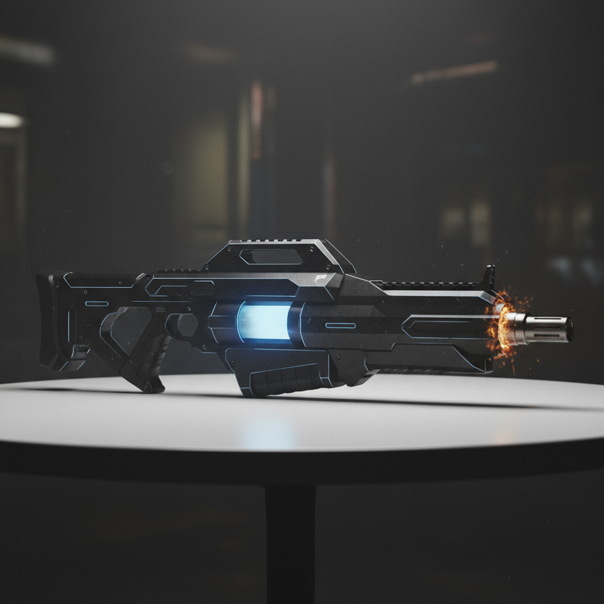
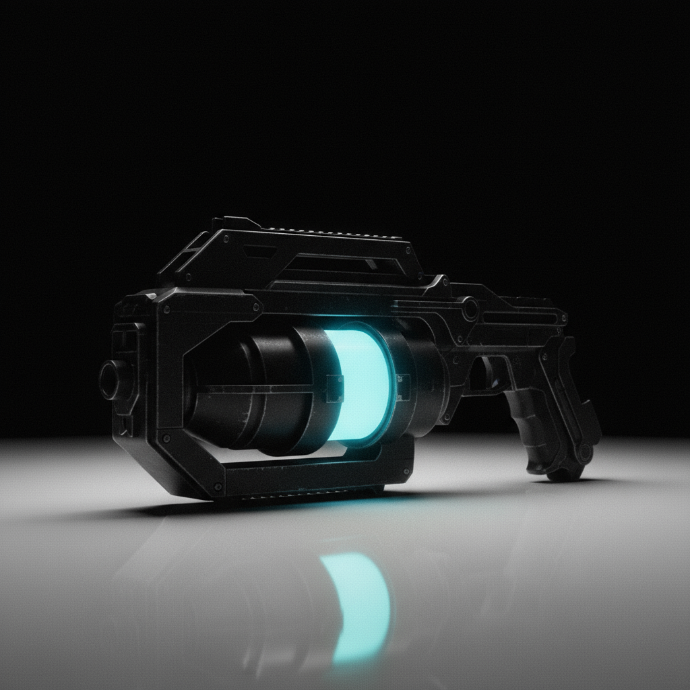
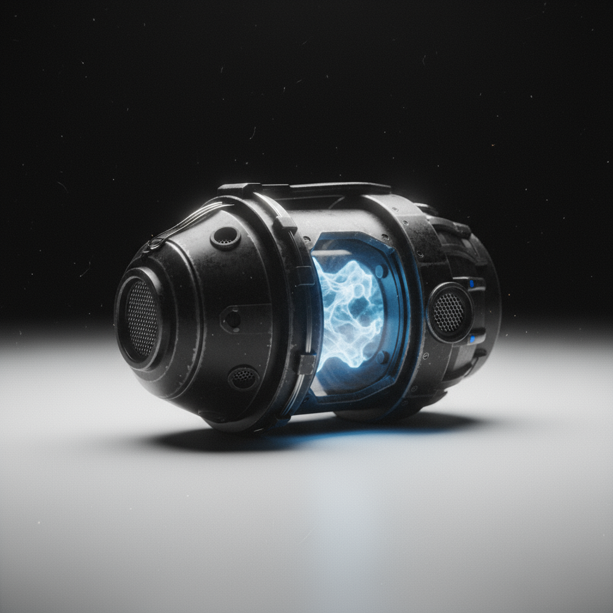
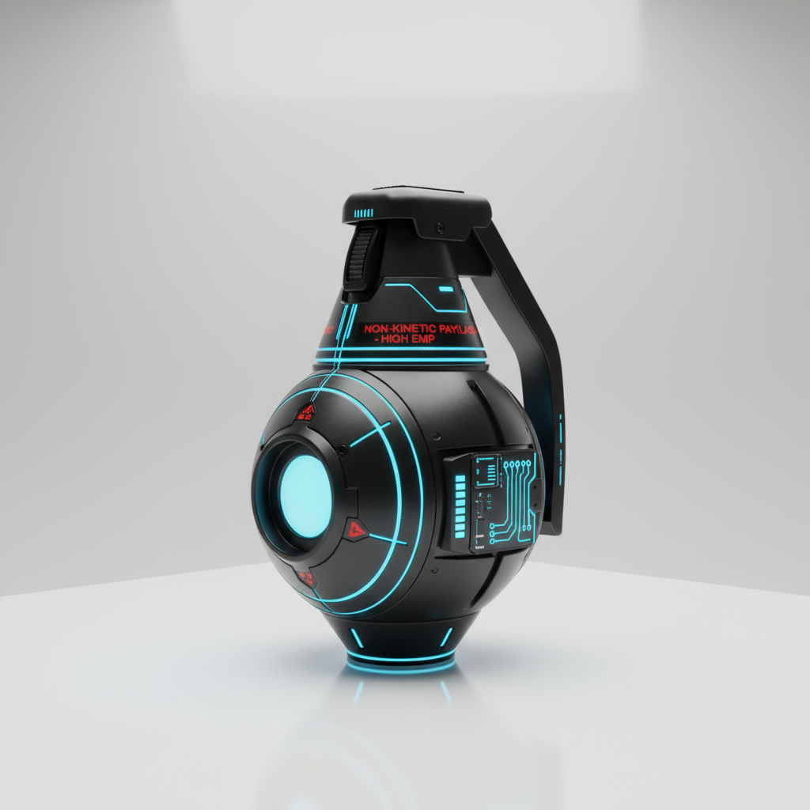
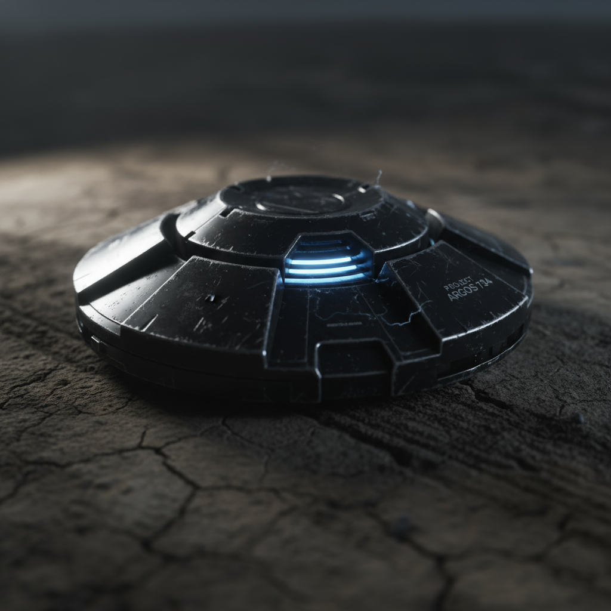

## 💥 Ручной гранатомёт PGH-11

**Тип питания:**  
Энергоячейка нового поколения, рассчитанная на 10 выстрелов без перезарядки. Стабильная подача энергии обеспечивает одинаковую мощность каждого плазменного заряда.

**Калибр:**  
Плазменный выстрел сверх высокого класса. Заряды формируют высокоэнергетический импульс, способный выводить из строя технику с лёгкой бронёй, прожигая защитные панели и нарушая электронику.  
В ближнем бою особенно эффективен при штурмовых операциях: создаёт сильное термическое давление и кратковременный дезориентирующий эффект.

**Масса:**  
9,2 кг

**Эффективная дальность:**  
До 500 метров. На этой дистанции сохраняется максимальная стабильность плазменного сгустка и его разрушительная сила. На меньших дистанциях эффект усиливается за счёт более плотного импульса.

---

## 💥 Ручной гранатомёт PGH-22

**Тип питания:**  
Энергоячейка, рассчитанная на один сверхмощный выстрел. Одноразовая подача энергии позволяет высвободить заряд максимальной плотности.

**Калибр:**  
Точечный плазменный выстрел ультра высокого класса пробития. Заряженная микро-сингулярная сердцевина импульса способна аннигилировать тяжёлую бронетехнику одним точным попаданием, разрушая структурные соединения и пробивая многослойную защиту.

**Масса:**  
7,5 кг

**Эффективная дальность:**  
До 500 метров. На этой дистанции гарантируется максимальная концентрация плазменной струи и предельная точность поражения цели. На ближних дистанциях эффект пробития только усиливается.

---

## ⚡ Электро-граната IME

Электро-граната IME — тактическое устройство нелетального воздействия.  
При подрыве создаёт мощный электромагнитный импульс и разряд, способный вывести из строя живую цель, временно парализуя мышцы и нервные сигналы. Электроника и техника в зоне поражения также отключаются или перезагружаются.  

**Эффективный радиус действия:**  
10 метров.

---

## 💣 Осколочная граната IME-1

Осколочная граната IME-1 — комбинированный боеприпас двойного действия.  
При подрыве генерирует парализующий электрический импульс, временно выводящий из строя живые цели в непосредственной близости. Следом корпус разлетается, создавая плотное осколочное поле с разлётом осколков до 35 метров, обеспечивая поражение площади и дезориентацию противника.  

Есть возможность установить таймер на гранату для различных тактических действий.

---

## ☢️ Мина обширного спектра IME-P-1

Мина обширного спектра IME-P-1 — универсальное подрывное устройство, способное работать против пехоты и техники. Оснащена датчиком массы: считывает вес цели и автоматически выбирает режим срабатывания.

**По технике:**  
Активирует мощный электроимпульс, временно выводящий системы из строя, после чего следует сильный взрыв, способный повредить или уничтожить даже тяжёлую технику.

**По пехоте:**  
Мина поднимается на уровень головы и действует в зависимости от настройки — либо наносит парализующий электрический разряд, либо выстреливает осколками по площади.

Позволяет как нейтрализовать, так и летально поразить цель, в зависимости от режима.

---

### 🔙 Навигация
[← Вернуться назад](../список.md)  
[🏠 На главную](../../../index.md)
