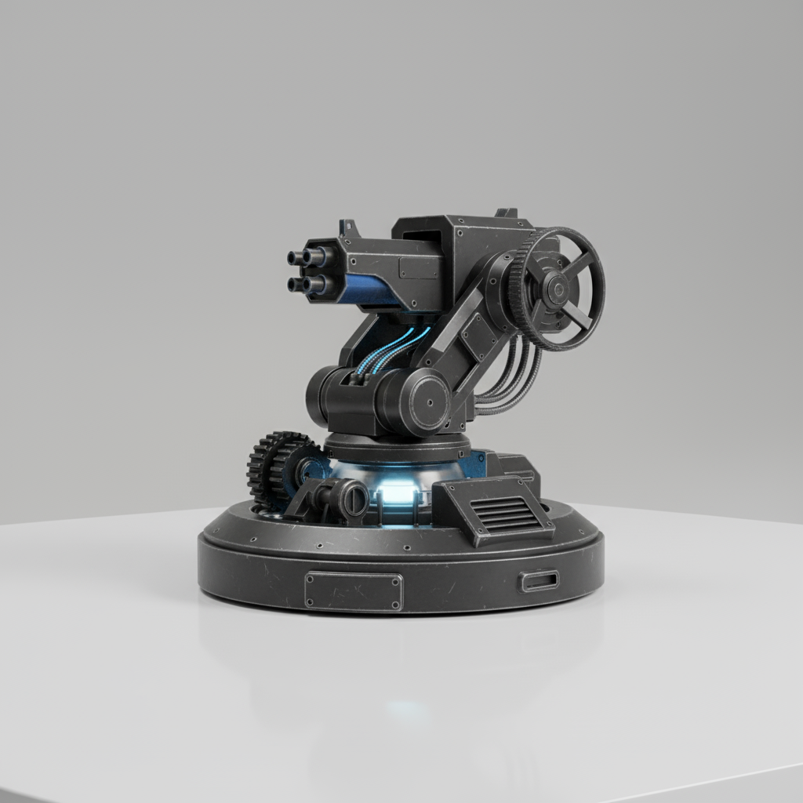
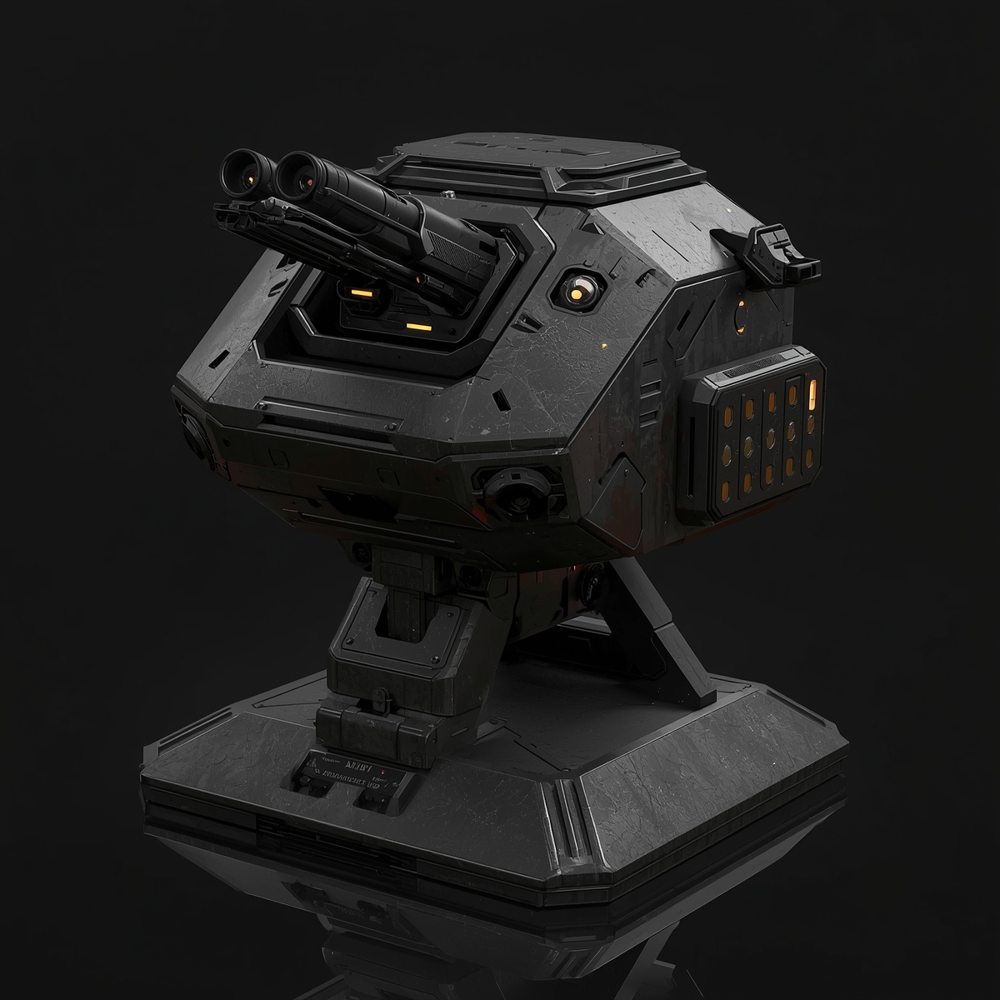
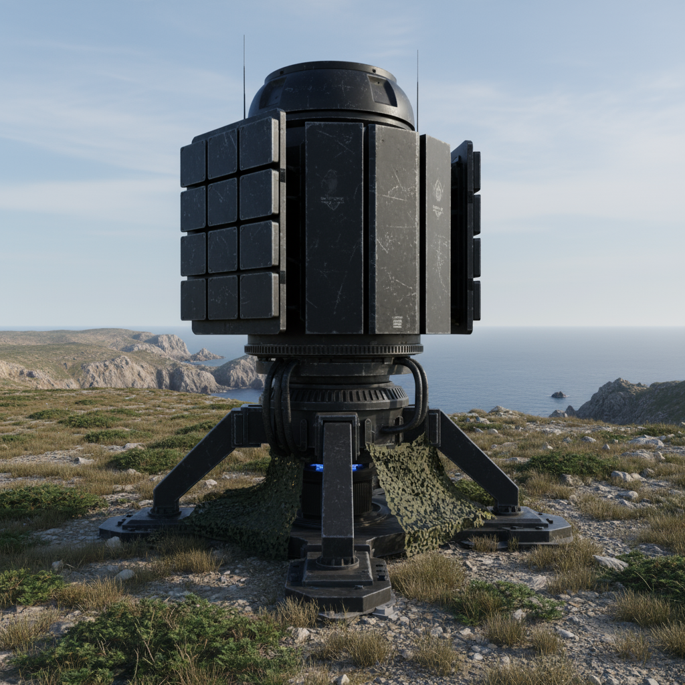

## 🔫 Автоматическая турель NR-K1

Автоматическая турель NR-K1 — высокоточная оборонительная система среднего калибра.  
Использует 12.5-мм боеприпасы, обеспечивает плотный огонь с скорострельностью 700 выстр./мин, сохраняя стабильность и низкую отдачу. Оснащена продвинутыми сенсорами наведения и эффективна на дистанциях до 1.5 км, обеспечивая быстрое подавление целей и надёжную защиту периметра.

---

## 🔫 Автоматическая турель MK-11

Автоматическая турель MK-11 — универсальная боевая установка со спаренными стволами, способная работать как по воздушным, так и по наземным целям.  

Основной ствол использует 17-мм боеприпасы, позволяя эффективно поражать пехоту и лёгкую технику с скорострельностью 60 выстр./мин.  

Второй, зенитный ствол — мелкого калибра, предназначен для подавления воздушных целей, обеспечивая до 1000 выстр./мин.  

Турель сочетает точность, гибкость применения и высокую плотность огня по движущимся целям.

---

## 📡 Радар на феромонах

Радар на феромонах — это биотехнологическая система обнаружения, основанная на распознавании и анализе химических сигналов.  
Устройство фиксирует следы феромонов, реагирует на их концентрацию и направление распространения, после чего строит карту источников и маршрутов движения.  

Такой радар работает бесшумно, эффективно в условиях плохой видимости и позволяет отслеживать цели, которые оставляют химические метки в окружающей среде.

---

### 🔙 Навигация
[← Вернуться назад](../список.md)  
[🏠 На главную](../../../index.md)
