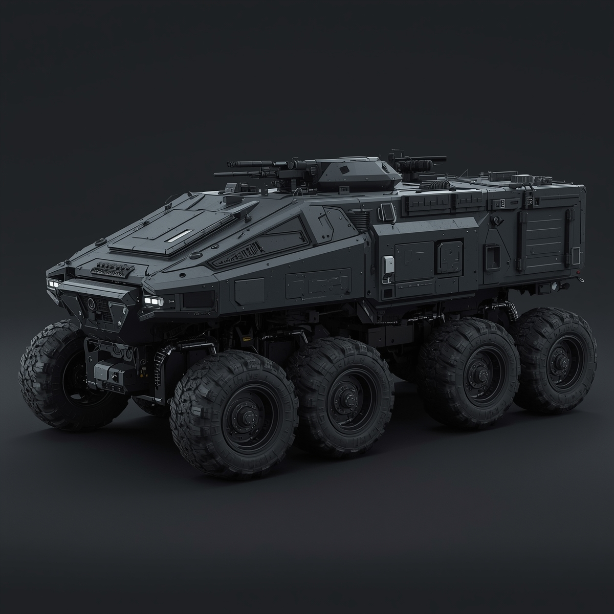
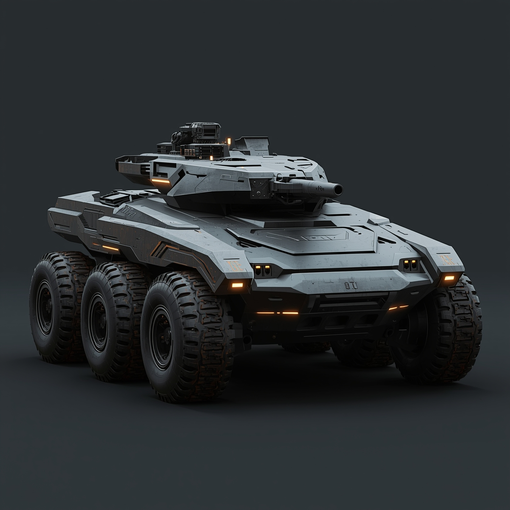
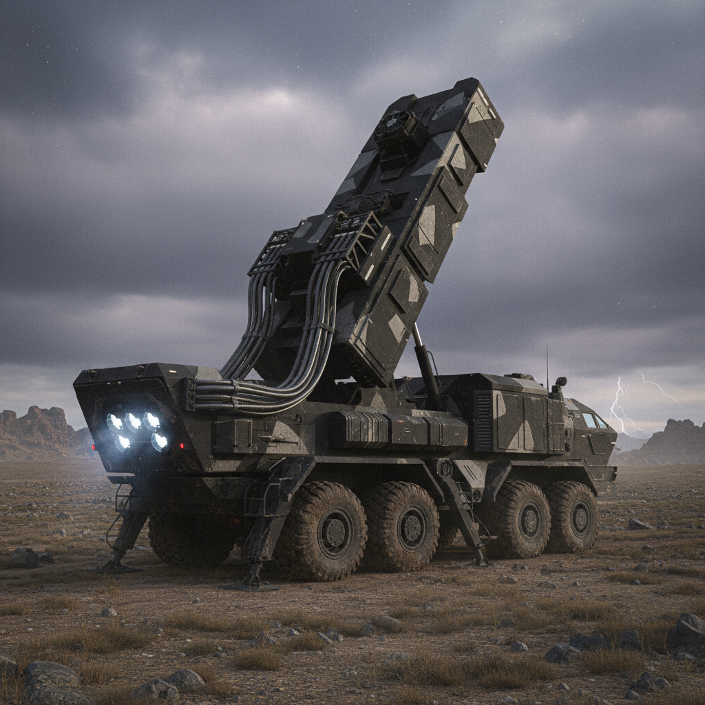

## 🚙 TX 01

**Тип бронетехники:** БТР  
**Экипаж:** 2 человека: пилот и командир  
**Масса техники:** 28 тонн  
**Класс защиты:** Уровень защиты 3  

**Вооружение:**  
малая башня на крыше с двумя мелкокалиберными пушками, возможность установки дистанционно управляемого пулемётного модуля и пусковых установок для дымовых гранат  

**Угол обзора:** 360 градусов  
**Вместимость:** до 15 человек личного состава в транспортном отсеке  

### Сильные стороны
Компоновка рассчитана на быструю посадку и высадку личного состава при сохранении защищённости боевого отделения.  
Модульная бронеобшивка с карбазионовыми вставками даёт надёжную защиту от среднего стрелкового оружия и осколков.  
Башенный модуль обеспечивает круговой обстрел и поддержку пехоты на марше.  
Система наблюдения с обзором на 360 градусов минимизирует слепые зоны и повышает командную осведомлённость.  
Шасси с восемью колёсами обеспечивает проходимость по пересечённой местности и частичную живучесть при повреждении одного или двух колёс.  
Вместимость до пятнадцати бойцов позволяет применять машину в качестве боевой платформы для быстрых десантных операций.  

### Слабые стороны
Бронезащита ограничена против реактивных и противотанковых средств тяжёлого класса.  
Верхние конструкции уязвимы при атаке сверху с кассетных боеприпасов или беспилотных летательных аппаратов.  
Ограниченный экипаж создаёт нагрузку на обслуживание и обзор в условиях интенсивного боя.  
Высокая масса снижает максимальную скорость и манёвренность на скоростных трассах.  
Сложность логистики и необходимость регулярного технического обслуживания электроники и ходовой части увеличивают время подготовки к длительным операциям.

---

## 🛡 UKO-1

**Тип бронетехники:** Лёгкий боевой танк  
**Экипаж:** 3 человека: водитель, стрелок, командир  
**Масса техники:** 62 тонны  
**Класс защиты:** Уровень защиты 5  

**Вооружение:**  
Автоматическая кинетико-плазменная пушка калибра 80 мм с системой автозагрузки, дистанционно управляемый модуль с пулемётом и противотанковыми ракетами, система активной защиты для перехвата кумулятивных снарядов и реактивных угроз  

**Угол обзора:** 360 градусов за счёт интегрированной системы кругового наблюдения  
**Вместимость:** свободное отделение для до четырёх десантников или дополнительного боекомплекта  

### Сильные стороны
Комплексная броневая защита включает многослойные композитные панели и динамическую защиту что обеспечивает высокий уровень живучести на поле боя.  
Активная защита резко снижает угрозу от противотанковых средств.  
Мощная основная пушка позволяет поражать бронированные цели на больших дистанциях.  
Продвинутая система наблюдения с многодиапазонными сенсорами даёт превосходную ситуационную осведомлённость.  
Модульная архитектура облегчает ремонт и модернизацию в полевых условиях.  

### Слабые стороны
Большая масса ограничивает манёвренность в плотной городской застройке и на слабых мостах.  
Уязвимость к мощным авиационным ударам и кассетным контейнерам сверху.  
Зависимости от электроники и активных модулей повышают потребность в технической поддержке.  
Длительная эксплуатация активной защиты и сенсорных систем требует частой замены энергоячеек и специализированного обслуживания.

---

## 🚀 ARS-1 «Мидас»

**Тип бронетехники:** Передвижная ракетная установка  
**Экипаж:** 2 человека (водитель / командир-оператор)  
**Масса техники:** 50 тонн  
**Класс защиты:** Уровень защиты 2  

**Вооружение:**  
Основное: модульная поворотно-подъёмная пусковая установка AUREUS-12, адаптированная под уменьшенный тактический комплект — 6 специализированных тактических ракет в запусках (фиксированное количество: 6 шт.)

**Дальность стрельбы:**  
заявленная характеристика — теоретически достаточная для «двух полных оборотов вокруг Земли» (в качестве примера использовался земной шарик)

**Средства защиты ракеты:**  
каждая ракета оснащена системой активной маскировки/тепловых ловушек и комплексом ложных целей, что значительно усложняет перехват и поражение ракеты средствами ПВО/ПРО противника.

**Эффект при детонации (заданные уровни разрушения):**  
~100 кв/км — полное уничтожение в зоне поражения  
~150 кв/км — значительные разрушения  
~180 кв/км — незначительные разрушения  

**Безопасная дистанция от точки взрыва:**  
порядка 200 км (зона, в пределах которой не гарантируется полная безопасность объектов/персонала)

**Типы боеприпасов (вариативность):**  
Боевые снаряды — стандартные проникновенные и разрушительные боеголовки для поражения инфраструктуры и скоплений техники/личного состава.  
Электроснаряды — специальные тактические боеприпасы, при срабатывании создающие мощный электромагнитно-электронный импульс/поле, способное обесточить и вывести из строя всю электронику в радиусе до ~100 кв.км, при этом заявленно не нанося прямого физического вреда живой инфраструктуре.

**Ограничение доступа и управление применением:**  
доступ к подрывным/электро-типам вооружения и к пусковым кодам имеют только высшие чины командования; система арминга/аутентификации многоуровневая (криптокоды, биометрия командира, распределённые ключи).

---

### 🔙 Навигация
[← Вернуться назад](../список.md)  
[🏠 На главную](../../../index.md)
