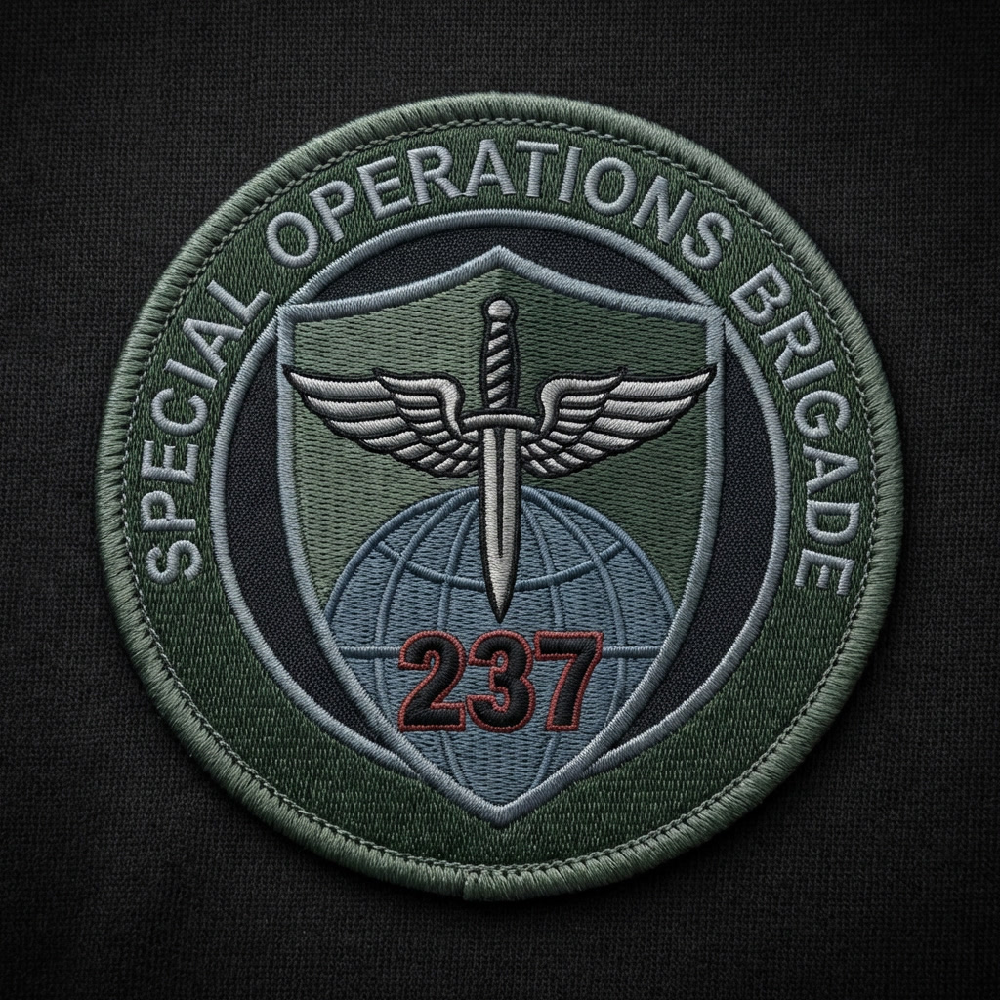

## 🛡 237-я Бригада специального назначения

237-я бригада была сформирована в 2981 году как отряд для специальных боевых операций. Её задачей стали миссии в экстремальных, почти невыносимых условиях и операции с высокой концентрацией угроз; до запуска проекта «Исход» бойцы действовали по всему земному шару.

Состав отбирали жёстко: сотни изнурительных испытаний отсеивали тех, кто не выдерживал нагрузки. Цель была проста — создать из людей живые машины, способные выполнять критические тактические задачи. В подготовку систематически внедряли кодовые словесные триггеры, которые при необходимости активировали боевой потенциал бойца.

К моменту включения в проект «Исход» численность бригады превышала четырёхсот человек. В рамках «Исхода» ей поручили поддержание порядка на корабле и нейтрализацию любых возникавших угроз.

**Известное командование:**  
— бригадный генерал **Мартин Смит** — стратегическое руководство, планирование операций и принятие окончательных решений в критических ситуациях;  
— заместитель: суб-лейтенант **Дмитрий Годунов** — непосредственная координация подразделений, оперативная готовность и передача приказов на уровне взвод–рота.

Остальные члены штаба и личный состав полностью засекречены: их имена, прошлое и даже биографические детали доступны только в узком круге. Это правило охватывает не только административные документы, но и записи о прохождении отбора, медицинских адаптациях и вшитых триггерах — доступ к ним строго регламентирован.

*Мы продолжаем бороться там, где другие не выживают.*

---

### 🔙 Навигация
[← Вернуться назад](../список.md)  
[🏠 На главную](../../index.md)
